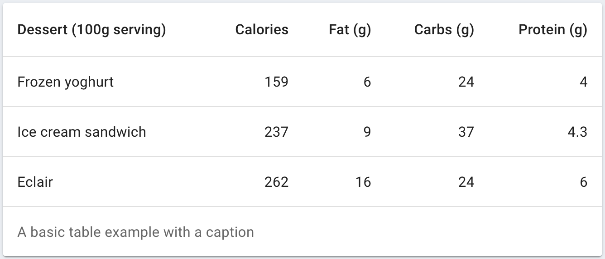
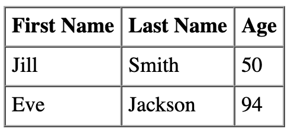
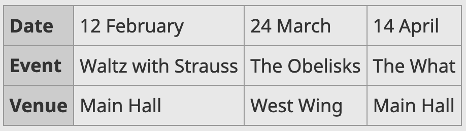
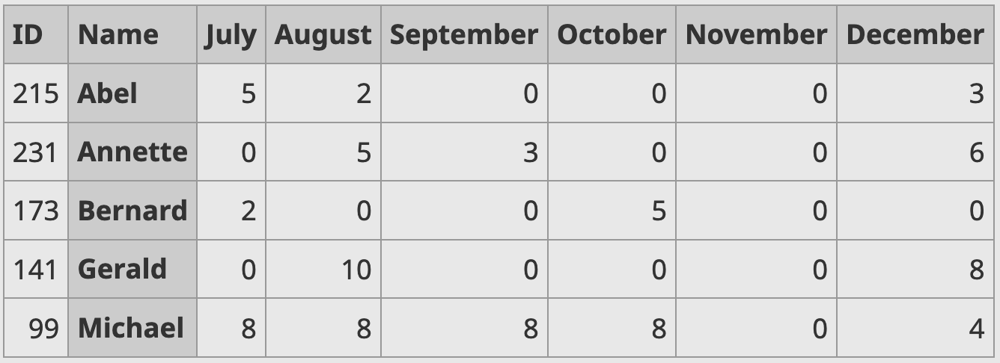
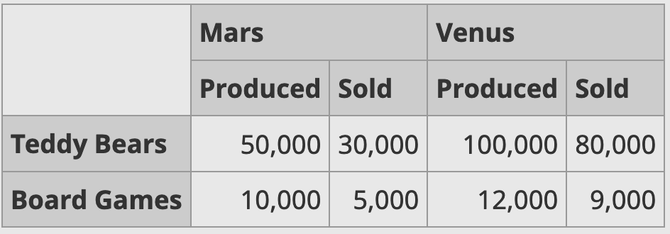

# Tables

## What Are Tables?
*Tables display sets of data.*<sup>[[1]](https://mui.com/components/tables/)</sup>  
*HTML tables allow web developers to arrange data into rows and columns.*<sup>[[2]](https://www.w3schools.com/html/html_tables.asp)</sup>

Any information or data that lends itself well to a tabular view (e.g. sales data, football leagues, or population statistics) can be shown in a table.

## Example Tables

### MUI Tables


<details>
  <summary>Code for the table above</summary>

  ```javascript
  import * as React from 'react';
  import Table from '@mui/material/Table';
  import TableBody from '@mui/material/TableBody';
  import TableCell from '@mui/material/TableCell';
  import TableContainer from '@mui/material/TableContainer';
  import TableHead from '@mui/material/TableHead';
  import TableRow from '@mui/material/TableRow';
  import Paper from '@mui/material/Paper';

  function createData(name, calories, fat, carbs, protein) {
    return { name, calories, fat, carbs, protein };
  }

  const rows = [
    createData('Frozen yoghurt', 159, 6.0, 24, 4.0),
    createData('Ice cream sandwich', 237, 9.0, 37, 4.3),
    createData('Eclair', 262, 16.0, 24, 6.0),
  ];

  export default function AccessibleTable() {
    return (
      <TableContainer component={Paper}>
        <Table sx={{ minWidth: 650 }} aria-label="caption table">
          <caption>A basic table example with a caption</caption>
          <TableHead>
            <TableRow>
              <TableCell>Dessert (100g serving)</TableCell>
              <TableCell align="right">Calories</TableCell>
              <TableCell align="right">Fat&nbsp;(g)</TableCell>
              <TableCell align="right">Carbs&nbsp;(g)</TableCell>
              <TableCell align="right">Protein&nbsp;(g)</TableCell>
            </TableRow>
          </TableHead>
          <TableBody>
            {rows.map((row) => (
              <TableRow key={row.name}>
                <TableCell component="th" scope="row">
                  {row.name}
                </TableCell>
                <TableCell align="right">{row.calories}</TableCell>
                <TableCell align="right">{row.fat}</TableCell>
                <TableCell align="right">{row.carbs}</TableCell>
                <TableCell align="right">{row.protein}</TableCell>
              </TableRow>
            ))}
          </TableBody>
        </Table>
      </TableContainer>
    );
  }
  ```
  
</details>
<br />
<br />

---

<br />
<br />

### HTML Tables

#### Standard Table



<details>
  <summary>Code for the table above</summary>
  
  ```html
  <table>
    <tr>
      <th>First Name</th>
      <th>Last Name</th>
      <th>Age</th>
    </tr>
    <tr>
      <td>Jill</td>
      <td>Smith</td>
      <td>50</td>
    </tr>
    <tr>
      <td>Eve</td>
      <td>Jackson</td>
      <td>94</td>
    </tr>
  </table>
  ```

</details>
<br />
<br />

#### Transposed Table



<details>
  <summary>Code for the table above</summary>
  
  ```html
  <table>
    <tr>
      <th>Date</th>
      <td>12 February</td>
      <td>24 March</td>
      <td>14 April</td>
    </tr>
    <tr>
      <th>Event</th>
      <td>Waltz with Strauss</td>
      <td>The Obelisks</td>
      <td>The What</td>
    </tr>
    <tr>
      <th>Venue</th>
      <td>Main Hall</td>
      <td>West Wing</td>
      <td>Main Hall</td>
    </tr>
  </table>
  ```

</details>
<br />
<br />

#### Offset Header Column



<details>
  <summary>Code for the table above</summary>
  
  ```html
  …
  <tr>
    <td>215</td>
    <th scope="row">Abel</th>
    <td>5</td>
    <td>2</td>
    <td>0</td>
    <td>0</td>
    <td>0</td>
    <td>3</td>
  </tr>
  …
  ```

</details>
<br />
<br />

#### Two-Tier Header Column



<details>
  <summary>Code for the table above</summary>
  
  ```html
  <table>
    <col>
    <colgroup span="2"></colgroup>
    <colgroup span="2"></colgroup>
    <tr>
      <td rowspan="2"></td>
      <th colspan="2" scope="colgroup">Mars</th>
      <th colspan="2" scope="colgroup">Venus</th>
    </tr>
    <tr>
      <th scope="col">Produced</th>
      <th scope="col">Sold</th>
      <th scope="col">Produced</th>
      <th scope="col">Sold</th>
    </tr>
    <tr>
      <th scope="row">Teddy Bears</th>
      <td>50,000</td>
      <td>30,000</td>
      <td>100,000</td>
      <td>80,000</td>
    </tr>
    <tr>
      <th scope="row">Board Games</th>
      <td>10,000</td>
      <td>5,000</td>
      <td>12,000</td>
      <td>9,000</td>
    </tr>
  </table>
  ```

</details>
<br />
<br />

---

## Best Practices

### Table Headers

:warning: **Always** add table headers `<th>` to tables to be fully accessible.

### Table Captions
*A caption functions like a heading for a table. Most screen readers announce the content of captions. Captions help users to find a table and understand what it's about and decide if they want to read it.*<sup>[[3]](https://mui.com/components/tables/#caption)</sup>

Captions can be beneficial to people using screen readers and are recommended.
<br />
<br />

## More Information
* [W3 Web Accessibility Initiative - Table Concepts](https://www.w3.org/WAI/tutorials/tables/)
* [W3 Schools - HTML Tables](https://www.w3schools.com/html/html_tables.asp)
* [IETF - HTML Tables (RFC 1942)](https://datatracker.ietf.org/doc/html/rfc1942)
