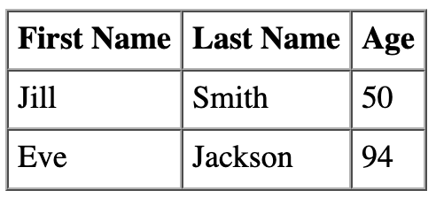

# Tables

## What Are Tables?
*Tables display sets of data.*<sup>[[1]](https://mui.com/components/tables/)</sup>  
*HTML tables allow web developers to arrange data into rows and columns.*<sup>[[2]](https://www.w3schools.com/html/html_tables.asp)</sup>

Any information or data that lends itself well to a tabular view (e.g. sales data, football leagues, or population statistics) can be shown in a table.

## Example Tables

### MUI Tables


<details>
  <summary>JavaScript</summary>
  
  Code for the table above.
  
  ```javascript
  import * as React from 'react';
  import Table from '@mui/material/Table';
  import TableBody from '@mui/material/TableBody';
  import TableCell from '@mui/material/TableCell';
  import TableContainer from '@mui/material/TableContainer';
  import TableHead from '@mui/material/TableHead';
  import TableRow from '@mui/material/TableRow';
  import Paper from '@mui/material/Paper';

  function createData(name, calories, fat, carbs, protein) {
    return { name, calories, fat, carbs, protein };
  }

  const rows = [
    createData('Frozen yoghurt', 159, 6.0, 24, 4.0),
    createData('Ice cream sandwich', 237, 9.0, 37, 4.3),
    createData('Eclair', 262, 16.0, 24, 6.0),
  ];

  export default function AccessibleTable() {
    return (
      <TableContainer component={Paper}>
        <Table sx={{ minWidth: 650 }} aria-label="caption table">
          <caption>A basic table example with a caption</caption>
          <TableHead>
            <TableRow>
              <TableCell>Dessert (100g serving)</TableCell>
              <TableCell align="right">Calories</TableCell>
              <TableCell align="right">Fat&nbsp;(g)</TableCell>
              <TableCell align="right">Carbs&nbsp;(g)</TableCell>
              <TableCell align="right">Protein&nbsp;(g)</TableCell>
            </TableRow>
          </TableHead>
          <TableBody>
            {rows.map((row) => (
              <TableRow key={row.name}>
                <TableCell component="th" scope="row">
                  {row.name}
                </TableCell>
                <TableCell align="right">{row.calories}</TableCell>
                <TableCell align="right">{row.fat}</TableCell>
                <TableCell align="right">{row.carbs}</TableCell>
                <TableCell align="right">{row.protein}</TableCell>
              </TableRow>
            ))}
          </TableBody>
        </Table>
      </TableContainer>
    );
  }
  ```
  
</details>

---

### HTML Tables


<details>
  <summary>HTML</summary>
  
  Code for the table above.
  
  ```html
  <table border=1 cellspacing=0 cellpadding=5>
    <tr>
      <th>First Name</th>
      <th>Last Name</th>
      <th>Age</th>
    </tr>
    <tr>
      <td>Jill</td>
      <td>Smith</td>
      <td>50</td>
    </tr>
    <tr>
      <td>Eve</td>
      <td>Jackson</td>
      <td>94</td>
    </tr>
  </table>
  ```
  
</details>

---

## Best Practices

### Table Headers
Add table headers `<th>` to tables.

### Table Captions
*A caption functions like a heading for a table. Most screen readers announce the content of captions. Captions help users to find a table and understand what it's about and decide if they want to read it.*<sup>[[3]](https://mui.com/components/tables/#caption)</sup>

## More Information
* [W3 Schools - HTML Tables](https://www.w3schools.com/html/html_tables.asp)
* [IETF - HTML Tables (RFC 1942)](https://datatracker.ietf.org/doc/html/rfc1942)
